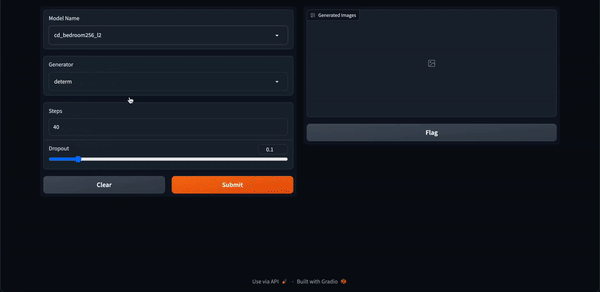

# Consistency Models

Consistency-Models is entirely new paradigm for zero-shot image generation and editing. Diffusion models generate images with iterative sampling procedure which usually is very slow whereas consistency models aim to generate images in a single shot. This repository contains ready-to train models & demo to generate images. This repository utilizes original [Consistency-Models](https://github.com/openai/consistency_models) ([arxiv](https://arxiv.org/abs/2303.01469)) implementation. Moreover, we have created helper scripts to train the models and Gradio app to generate images using pre-trained models.


## Run in a Free GPU powered Gradient Notebook
[](https://console.paperspace.com/github/ashutosh1919/consistency-models?machine=Free-GPU)


## Setup

The file `installations.sh` contains all the necessary code to install required things. Note that your system must have CUDA to train Consistency models. Also, you may require different version of `torch` based on the version of CUDA. If you are running this on [Paperspace](https://www.paperspace.com/), then the default version of CUDA is 11.6 which is compatible with this code. If you are running it somewhere else, please check your CUDA version using `nvcc --version`. If the version differs from ours, you may want to change versions of PyTorch libraries in the first line of `installations.sh` by looking at [compatibility table](https://github.com/pytorch/pytorch/wiki/PyTorch-Versions).

To install all the dependencies, run below command:

```bash
bash installations.sh
```

Above command also clones the original [Consistency-Models](https://github.com/openai/consistency_models) repository into `consistency_models` directory so that we can utilize the original model implementation for training & inference.


## Downloading datasets & Start training (Optional)

`datasets` directory in this repo contains necessary scripts to download the data and make it ready for training. Currently, this repository supports downloading [ImageNet](https://www.image-net.org/) and [LSUN Bedroom](https://www.yf.io/p/lsun) datasets that original authors used.

We have already setup bash scripts for you which will automatically download the dataset for you and will start the training. `datasets` contains the code which will download the training & validation data to the same directory. To download the datasets, you can run below code:

```bash
# Download the ImageNet dataset
cd datasets/imagenet/ && bash fetch_imagenet.sh

# Download the LSUN Bedroom dataset
cd datasets/lsun_bedroom/ && bash fetch_lsun_bedroom.sh
```

Moreover, we have provided scripts to train different types of models as authors have discussed in the paper. `scripts` directory contains different bash scripts to train the models. You can run scripts with below commands to train different models:

```bash
# EDM Model on ImageNet dataset
bash scripts/train_edm/train_imagenet.sh

# EDM Model on LSUN Bedroom dataset
bash scripts/train_edm/train_lsun_bedroom.sh

# Consistency Distillation Model on ImageNet dataset (L2 measure)
bash scripts/train_cd/train_imagenet_l2.sh

# Consistency Distillation Model on ImageNet dataset (LPIPS measure)
bash scripts/train_cd/train_imagenet_lpips.sh

# Consistency Distillation Model on LSUN Bedroom dataset (L2 measure)
bash scripts/train_cd/train_lsun_bedroom_l2.sh

# Consistency Distillation Model on LSUN Bedroom dataset (LPIPS measure)
bash scripts/train_cd/train_lsun_bedroom_lpips.sh

# Consistency Training Model on ImageNet dataset
bash scripts/train_ct/train_imagenet.sh

# Consistency Training Model on LSUN Bedroom dataset
bash scripts/train_ct/train_lsun_bedroom.sh
```

This bash script is compatible to the Paperspace workspace. But if you are running it elsewhere, then you will need to replace base path of the paths mentioned in the corresponding training script.

Note that you will need to move `checkpoint.pt` file to `checkpoints` directory for inference at the end of training.

Don't worry if you don't want to train the model. Below section illustrates downloading the pretrained checkpoints for inference.


## Running Gradio Demo

Python script `app.py` contains Gradio demo which lets you generate images using pre-trained models. But before we do that, we need to download the pretrained checkpoints into `checkpoints` directory.

To download existing checkpoints, run below command:

```bash
bash checkpoints/fetch_checkpoints.sh
```

Note that the latest version of code has the pretrained checkpoints for 12 different model types. You can add the code in `fetch_checkpoints.sh` whenever you have the new checkpoints.

Now, we are ready to launch Gradio demo. Run following command to launch demo:

```bash
gradio app.py
```

Open the link in the browser and now you can generate inference from any of available models in `checkpoints` directory. Moreover, you can generate images by modifying different parameters like `dropout`, `generator`, and `steps`.

You should be able to generate images using different pre-trained models as shown below:



Hurray! 🎉🎉🎉  We have created demo to generate images using different pre-trained consistency models.


## Original Code

`consistency_models` directory contains the original code taken from [Consistency-Models](https://github.com/openai/consistency_models) repository. The code present in this directory is exactly same as the original code.


## Reference

Consistency Models -- https://arxiv.org/abs/2303.01469

```
@misc{song2023consistency,
      title={Consistency Models}, 
      author={Yang Song and Prafulla Dhariwal and Mark Chen and Ilya Sutskever},
      year={2023},
      eprint={2303.01469},
      archivePrefix={arXiv},
      primaryClass={cs.LG}
}
```

## License

See the [LICENSE](LICENSE) file.
